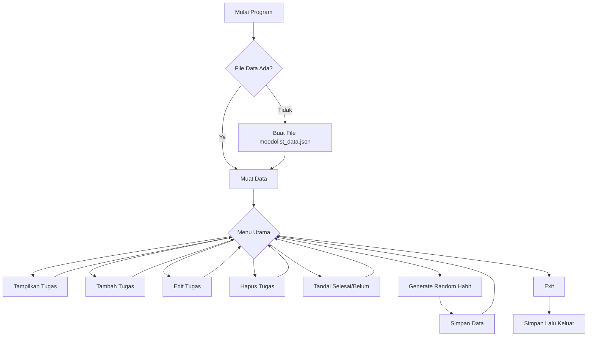

Judul Program: Moodolist

Pendahuluan:
Moodolist adalah aplikasi terminal berbasis Python yang menggabungkan dua fungsi utama:
1. To-Do List untuk mencatat tugas harian, dan
2. Random Habit Generator untuk memberikan kebiasaan acak yang memotivasi setiap hari.
Aplikasi ini membantu pengguna tetap produktif dengan memadukan sistem manajemen tugas dan pengembangan kebiasaan secara sederhana namun efektif.

Fitur Utama:
🔹 To-Do List
- Tambah tugas baru
- Edit tugas
- Hapus tugas
- Tandai selesai/belum selesai
- Lihat semua daftar tugas
🔹 Random Habit Generator
- Menyediakan daftar habit default
- Menghasilkan 1–3 habit acak per hari
- Toggle status habit selesai/belum
- Habit memiliki ID unik (dimulai dari 1000)
🔹 Daily Board (Gabungan To-Do + Habit)
- Menampilkan semua task harian
- Menghitung progress harian (%)
- Mengelompokkan task berdasarkan kategori
- Menampilkan ringkasan produktivitas

Panduan Instalasi:
Bagian Panduan Instalasi bertujuan memberi arahan kepada pengguna mengenai langkah awal sebelum menjalankan aplikasi Moodolist. Langkah pertama adalah mengunduh proyek dari GitHub dengan perintah git clone, yang akan menyalin seluruh isi repositori ke komputer. Setelah itu, pengguna perlu masuk ke folder hasil clone menggunakan cd Moodolist , karena seluruh berkas program berada di dalam folder tersebut dan semua perintah berikutnya harus dijalankan dari sana.

Pengguna juga dapat membuat virtual environment untuk memisahkan dependensi proyek dari instalasi Python utama, sehingga pengembangan lebih teratur dan profesional. Walaupun tidak wajib, langkah ini tetap dianjurkan dalam praktik pemrograman. Setelah environment aktif, biasanya dibutuhkan instalasi library tambahan, namun Moodolist hanya menggunakan modul bawaan Python sehingga tidak ada paket lain yang perlu dipasang. Jika semua langkah persiapan sudah dilakukan, aplikasi bisa dijalankan dengan perintah python main.py.

Panduan Menjalankan:
Jalankan aplikasi melalui file main.py:
python main.py

Setelah itu akan muncul menu interaktif sebagai berikut:
1. Tambah To-Do
2. Lihat Semua Task
3. Toggle Task (Selesai/Belum)
4. Generate Daily Habits
5. Lihat Ringkasan
6. Hapus To-Do
7. Edit To-Do
0. Keluar

Dokumentasi Teknis:
Flowchart:

Program dimulai dengan memeriksa apakah file data sudah ada. Jika belum, program membuat file baru dan mengisi daftar habit awal. Setelah itu, program mengecek apakah hari telah berganti untuk menentukan apakah perlu menghasilkan 1–3 habit acak untuk hari tersebut.

Selanjutnya, program menampilkan menu utama kepada pengguna. Pengguna memilih aksi seperti menambah tugas, mengedit, menghapus, melihat daftar, atau mengelola habit. Setiap pilihan diproses dan program kembali ke menu utama. Ketika pengguna memilih keluar, program menyimpan seluruh perubahan ke file moodolist_data.json, lalu program berhenti.

 Daftar Kontributor
 
| Nama Lengkap                      | NIM            | Link Akun GitHub                |
|-----------------------------------|----------------|---------------------------------|
| Kayla Sriulina Sembiring          | 250211060005   | https://github.com/kaylaasem    |
| Stacia Gracia Pangemanan          | 250211060012   | https://github.com/staciagracia |
| Brinnete Euanggelion Sunkudon     | 250211060019   | https://github.com/alteredbrinn |
